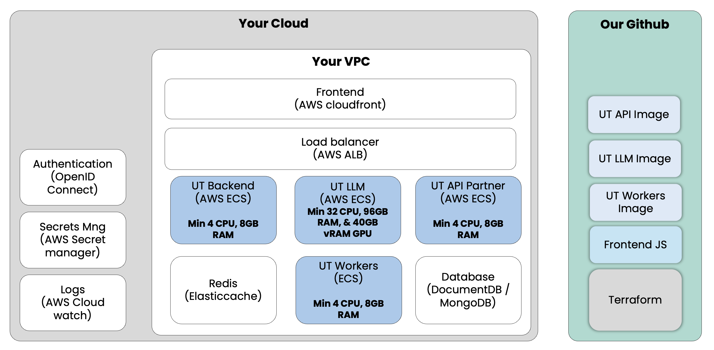

# UT Platform - Customer AWS Setup

This repository contains the Terraform codebase to provision and manage the infrastructure for the UT Platform on AWS.



## Getting started

### Requirements
To deploy UT Platform on your AWS account you need:

- **Terraform** ~> 1.12
- **Terraform AWS provider** ~> 5.0
- **GitHub Credentials** to retrieve docker images from the UnderstandTech registry
- **API keys** for public LLM services you want to use
- **AWS credentials**
- **AWS Account Requirements:**
    - A VPC
    - Public and private subnets for each availability zone you want to use
    - A deployment IAM role that can be assumed by yourself or your pipeline
    - An admin role that will be grantted access on AWS SecretsManager secrets
    - An ACM certificat for the cloudfront distribution
    - Custom alternate domain names for the CloudFront distribution

**NOTE:** ACM certificat **must** be provisionned in N. Virginia (us-east-1) AWS region.

**NOTE:** GitHub credentials for docker images are provided by UnderstandTech team.

### Deployment Steps

1. **Configure Terraform Variables:** Populate values in the vars.tf file.
2. **Initialize Terraform:** Run ``terraform init`` from inside the ``terraform`` directory.
3. **Plan Deployment:** Run ``terraform plan`` to visualize ressources to be deployed.
4. **Apply Deployment:** Run ``terraform apply`` to deploy the ressources.
5. **Configure DNS:** Create a DNS CNAME or Alias record over the Cloudfront distribution domain in your DNS service.
6. **AWS SecretsManager Setup:** Acces the AWS SecretsManager service on your account.
    - **GitHub Credentials:** Find the ``ut-github-container-registry-credentials`` secret and set it's value (replace placeholder values):

    ```json
    {
        "username":"your_username",
        "password":"your_password"
    }
    ```

    - **API Integration Secrets:** Locate the ``ut-api-secret_manual`` secret and configure accordingly (replace placeholder values):  

    ```json
    {
        "GPU_VM_API_TOKEN":"your_value",
        "SENDGRID_API_KEY":"your_value",
        "MICROSOFT_CLIENT_ID":"your_value",
        "MICROSOFT_CLIENT_SECRET":"your_value",
        "MICROSOFT_AUTHORITY":"your_value",
        "GOOGLE_CLIENT_ID":"your_value",
        "GOOGLE_CLIENT_SECRET":"your_value",
        "ZOHO_CLIENT_ID":"your_value",
        "ZOHO_CLIENT_SECRET":"your_value",
        "ZOHO_AUTH_URL":"your_value",
        "ZOHO_TOKEN_URL":"your_value",
        "ADMIN_MAIL":"your_value",
        "OPENID_CLIENT_ID":"your_value",
        "OPENID_CLIENT_SECRET":"your_value",
        "OPENID_SECRET_KEY":"your_value",
        "OPENID_FRONTEND_REDIRECT_URI":"your_value",
        "server_metadata_url":"your_value",
        "token_endpoint":"your_value",
        "jwks_endpoint":"your_value",
        "expected_issuer":"your_value",
        "openid_scope":"your_value",
        "OLLAMA_MODEL_LLM":"hf.co/bartowski/Qwen2.5-14B-Instruct-1M-GGUF:Q8_0",
        "OLLAMA_MODEL_CONDENSE_LLM":"hf.co/bartowski/Qwen2.5-14B-Instruct-1M-GGUF:Q8_0",
        "OLLAMA_HOST_PORT":11434,
        "MODELS_DIR":"/app/models/",
        "EMBED_URL":"https://huggingface.co/nomic-ai/nomic-embed-text-v1.5-GGUF/resolve/main/nomic-embed-text-v1.5.f32.gguf",
        "EMBED_MODEL_NAME":"nomic-embed-text-v1.5.f32.gguf",
        "RERANKER_HF_PATH":"BAAI/bge-reranker-v2-m3",
        "RERANKER_MODEL_NAME":"bge-reranker-v2-m3"
    }
    ```

### Mandatory Parameters

| Parameter                     | Required | Usage                                                                                 | Default value |
|------------------------------|----------|---------------------------------------------------------------------------------------|---------------|
| GPU_VM_API_TOKEN             | Yes      | Token for internal API to LLM authentication used for chat and model creation         |               |
| OPENID_CLIENT_ID             | Yes      | Client ID registered in your OpenID provider (e.g., AWS Cognito)                      |               |
| OPENID_CLIENT_SECRET         | Yes      | Client secret registered in your OpenID provider                                      |               |
| OPENID_SECRET_KEY            | Yes      | Key used to encrypt user sessions and state in the backend                            |               |
| OPENID_FRONTEND_REDIRECT_URI | Yes      | URI used by your OpenID provider to redirect user after authentication                | https://<your_domain>/en/login/openid-auth |
| server_metadata_url          | Yes      | URL to `.well-known/openid-configuration` on your OpenID provider                     |               |
| token_endpoint               | Yes      | OpenID token endpoint URL used during login flow                                      |               |
| jwks_endpoint                | Yes      | JWKS endpoint URL to fetch public signing keys for JWT validation                     |               |
| expected_issuer              | Yes      | Issuer string expected in received OpenID tokens for validation                       |               |
| openid_scope                 | Yes      | Scopes to request from the OpenID provider (e.g. `openid email profile`)              |               |
| OLLAMA_MODEL_LLM             | Yes      | HuggingFace path to the main LLM model used for answering user questions              | hf.co/bartowski/Qwen2.5-14B-Instruct-1M-GGUF:Q8_0 |
| OLLAMA_MODEL_CONDENSE_LLM    | Yes      | HuggingFace path to the LLM used for query rewriting/context condensation             | hf.co/bartowski/Qwen2.5-14B-Instruct-1M-GGUF:Q8_0 |
| OLLAMA_HOST_PORT             | Yes      | Port used by Ollama model server (should match internal LLM container config)         | 11434         |
| MODELS_DIR                   | Yes      | Filesystem directory path where LLM and embedding models are stored                   | /app/models/  |
| EMBED_URL                    | Yes      | URL to download the embedding model used for text vectorization                       | https://huggingface.co/nomic-ai/nomic-embed-text-v1.5-GGUF/resolve/main/nomic-embed-text-v1.5.f32.gguf |
| EMBED_MODEL_NAME             | Yes      | File name of the downloaded embedding model                                           | nomic-embed-text-v1.5.f32.gguf |
| RERANKER_HF_PATH             | Yes      | Hugging Face model path used for reranking search results in RAG                      | BAAI/bge-reranker-v2-m3 |
| RERANKER_MODEL_NAME          | Yes      | Local identifier used in backend code to load the reranker model                      | bge-reranker-v2-m3 |

### Optional Parameters

| Parameter              | Required | Usage                                                               | Default value |
|-----------------------|----------|---------------------------------------------------------------------|---------------|
| SENDGRID_API_KEY      | No       | Used to send notification emails via SendGrid (share model, invite user) |           |
| ADMIN_MAIL            | No       | Email address used as sender in SendGrid-based emails               |               |
| MICROSOFT_CLIENT_ID   | No       | OAuth client ID for accessing SharePoint/OneDrive documents         |               |
| MICROSOFT_CLIENT_SECRET | No     | OAuth client secret for accessing SharePoint/OneDrive               |               |
| MICROSOFT_AUTHORITY   | No       | OAuth authority URL (e.g., `https://login.microsoftonline.com/common`) |           |
| GOOGLE_CLIENT_ID      | No       | OAuth client ID for accessing Google Drive documents                |               |
| GOOGLE_CLIENT_SECRET  | No       | OAuth client secret for Google Drive integration                    |               |
| ZOHO_CLIENT_ID        | No       | OAuth client ID for Zoho CRM integration                            |               |
| ZOHO_CLIENT_SECRET    | No       | OAuth client secret for Zoho CRM                                    |               |
| ZOHO_AUTH_URL         | No       | Zoho OAuth authorization URL                                        |               |
| ZOHO_TOKEN_URL        | No       | Zoho OAuth token exchange URL         

### OpenID provider configuration

The OpenID provider app configuration will require a callback URI that need to be set to : 
```
https://<your_domain>/api/openid/callback
```


### Authentication Setup

The UT Platform optionaly deploys a Cognito User Pool if you do not already have your own Identity Provider.

When `enable_cognito = true` in `terraform.tfvars`, the Terraform deployment automatically creates:

- **Cognito User Pool**: Manages user registration, authentication, and profiles
- **Cognito User Pool Client**: Configured for OAuth2/OpenID Connect flows
- **Cognito Domain**: Provides hosted UI for authentication
- **Automatic Secret Configuration**: OpenID parameters are automatically populated in AWS Secrets Manager


## Configuration Details

### Docker Images

The UT platform relies on Docker images provided via UnterstandTech private GitHub container registry.  
AWS ECS Service must be able to access this registry; ensure GitHub credentials are stored in the ``ut-github-container-registry-credentials`` AWS SecretsManager secret as described above.

#### UT-Frontend

| Parameter | Value|
|-----------|------|
| Docker image | ghcr.io/understand-tech/ut-frontend-customer:latest |
| vCPU | 0.256 |
| Memory | 512 Mo |
| TCP port | 80 |
| Storage | N/A |


#### UT-API

| Parameter | Value|
|-----------|------|
| Docker image | ghcr.io/understand-tech/ut-api-customer:latest |
| vCPU | 4 |
| Memory | 8 Go |
| TCP port | 8501 |
| Storage* | 10 Go |

\* The storage is shared with below UT-Worker containers


#### UT-Worker

| Parameter | Value|
|-----------|------|
| Docker image | ghcr.io/understand-tech/ut-worker-customer:latest |
| vCPU | 4 |
| Memory | 8 Go |
| TCP port | N/A |
| Storage* | 10 Go |

\* The storage is shared with above UT-API containers


#### UT-LLM

| Parameter | Value|
|-----------|------|
| Docker image | ghcr.io/understand-tech/ut-llm-customer:latest |
| vCPU | 86 |
| Memory | 176 Go |
| TCP port | 8000 |
| Storage | 500 Go |


#### UT-Mongodb

| Parameter | Value|
|-----------|------|
| Docker image | mongo:8.0-rc-noble |
| vCPU | 0.256 |
| Memory | 512 Mo |
| TCP port | 27017 |
| Storage | 20 Go |


### Deployment IAM role
The Terraform setup requires an IAM role to deploy infrastructure on AWS. This role will be added to AWS SecretsManager secrets's policy to manage secrets.  
Ensure AWS credentials, capable of assuming this deployment role, are set up. Credentials can be passed via environment variables or directly in ``terraform/providers.tf``.

Required permissions for deploying the UT Platform include the following services :
| Service | IAM namespace | Permissions |
|---------|---------------|-------------|
| AWS Auto Scaling | ``autoscaling:`` | Read Write |
| Amazon CloudFront | ``cloudfront:`` | Read Write |
| Amazon CloudWatch Logs | ``logs:`` | Read Write |
| Amazon ECS | ``ecs:`` | Read Write |
| Amazon EC2 | ``ec2:`` | Read Write |
| Amazon ElastiCache | ``elasticache:`` | Read Write |
| Amazon Elastic File System | ``elasticfilesystem:`` | Read Write |
| Elastic Load Balancing | ``elasticloadbalancing:`` | Read Write |
| AWS Identity and Access Management | ``iam:`` | Read Write |
| Amazon S3 | ``s3:`` | Read Write |
| AWS Secrets Manager  | ``secretsmanager:`` | Read Write |


## Troubleshooting
### UT-LLM task being stopped by ELB health ckeck failure
If the UT-LLM task is stopped due to ELB health check failure, it could be caused by extended model update downloads. Verify CloudWatch logs under ``/ecs/llm`` for unfinished downloads before tasks are stopped. You may need to temporarily increase the ELB grace period for the UT-LLM task by adjusting ``health_check_grace_period_seconds`` in ``terraform/llm_ecs.tf``.

## Terraform resources
### Requirements

| Name | Version |
|------|---------|
| <a name="requirement_terraform"></a> [terraform](#requirement\_terraform) | ~> 1.12 |
| <a name="requirement_aws"></a> [aws](#requirement\_aws) | ~> 5.0 |

### Providers

| Name | Version |
|------|---------|
| <a name="provider_aws"></a> [aws](#provider\_aws) | ~> 5.0 |
| <a name="provider_aws.NVirginia"></a> [aws.NVirginia](#provider\_aws.NVirginia) | ~> 5.0 |
| <a name="provider_random"></a> [random](#provider\_random) | n/a |

### Modules

No modules.

### Resources

| Name | Type |
|------|------|
| [aws_autoscaling_group.ut_llg_asg](https://registry.terraform.io/providers/hashicorp/aws/latest/docs/resources/autoscaling_group) | resource |
| [aws_cloudfront_distribution.ut_frontend_distribution](https://registry.terraform.io/providers/hashicorp/aws/latest/docs/resources/cloudfront_distribution) | resource |
| [aws_cloudfront_function.ut_spa_redirect](https://registry.terraform.io/providers/hashicorp/aws/latest/docs/resources/cloudfront_function) | resource |
| [aws_cloudfront_vpc_origin.ut_frontend_alb](https://registry.terraform.io/providers/hashicorp/aws/latest/docs/resources/cloudfront_vpc_origin) | resource |
| [aws_cloudwatch_log_group.ut_api](https://registry.terraform.io/providers/hashicorp/aws/latest/docs/resources/cloudwatch_log_group) | resource |
| [aws_cloudwatch_log_group.ut_frontend](https://registry.terraform.io/providers/hashicorp/aws/latest/docs/resources/cloudwatch_log_group) | resource |
| [aws_cloudwatch_log_group.ut_llm](https://registry.terraform.io/providers/hashicorp/aws/latest/docs/resources/cloudwatch_log_group) | resource |
| [aws_cloudwatch_log_group.ut_mongodb](https://registry.terraform.io/providers/hashicorp/aws/latest/docs/resources/cloudwatch_log_group) | resource |
| [aws_cloudwatch_log_group.ut_workers](https://registry.terraform.io/providers/hashicorp/aws/latest/docs/resources/cloudwatch_log_group) | resource |
| [aws_ecs_capacity_provider.ut_llm_capacity_provider](https://registry.terraform.io/providers/hashicorp/aws/latest/docs/resources/ecs_capacity_provider) | resource |
| [aws_ecs_cluster.ut_cluster](https://registry.terraform.io/providers/hashicorp/aws/latest/docs/resources/ecs_cluster) | resource |
| [aws_ecs_cluster_capacity_providers.ut_llm_capacity_provider](https://registry.terraform.io/providers/hashicorp/aws/latest/docs/resources/ecs_cluster_capacity_providers) | resource |
| [aws_ecs_service.ut_api_service](https://registry.terraform.io/providers/hashicorp/aws/latest/docs/resources/ecs_service) | resource |
| [aws_ecs_service.ut_frontend_service](https://registry.terraform.io/providers/hashicorp/aws/latest/docs/resources/ecs_service) | resource |
| [aws_ecs_service.ut_llm_service](https://registry.terraform.io/providers/hashicorp/aws/latest/docs/resources/ecs_service) | resource |
| [aws_ecs_service.ut_mongodb_service](https://registry.terraform.io/providers/hashicorp/aws/latest/docs/resources/ecs_service) | resource |
| [aws_ecs_service.ut_workers_service](https://registry.terraform.io/providers/hashicorp/aws/latest/docs/resources/ecs_service) | resource |
| [aws_ecs_task_definition.ut_api](https://registry.terraform.io/providers/hashicorp/aws/latest/docs/resources/ecs_task_definition) | resource |
| [aws_ecs_task_definition.ut_frontend](https://registry.terraform.io/providers/hashicorp/aws/latest/docs/resources/ecs_task_definition) | resource |
| [aws_ecs_task_definition.ut_llm](https://registry.terraform.io/providers/hashicorp/aws/latest/docs/resources/ecs_task_definition) | resource |
| [aws_ecs_task_definition.ut_mongodb](https://registry.terraform.io/providers/hashicorp/aws/latest/docs/resources/ecs_task_definition) | resource |
| [aws_ecs_task_definition.ut_workers](https://registry.terraform.io/providers/hashicorp/aws/latest/docs/resources/ecs_task_definition) | resource |
| [aws_efs_file_system.ut_llm_models_file_system](https://registry.terraform.io/providers/hashicorp/aws/latest/docs/resources/efs_file_system) | resource |
| [aws_efs_file_system.ut_llm_ollama_file_system](https://registry.terraform.io/providers/hashicorp/aws/latest/docs/resources/efs_file_system) | resource |
| [aws_efs_file_system.ut_mongodb_file_system](https://registry.terraform.io/providers/hashicorp/aws/latest/docs/resources/efs_file_system) | resource |
| [aws_efs_file_system.ut_workers_file_system](https://registry.terraform.io/providers/hashicorp/aws/latest/docs/resources/efs_file_system) | resource |
| [aws_efs_mount_target.ut_llm_models_efs_mount_target](https://registry.terraform.io/providers/hashicorp/aws/latest/docs/resources/efs_mount_target) | resource |
| [aws_efs_mount_target.ut_llm_ollama_efs_mount_target](https://registry.terraform.io/providers/hashicorp/aws/latest/docs/resources/efs_mount_target) | resource |
| [aws_efs_mount_target.ut_mongodb_efs_mount_target](https://registry.terraform.io/providers/hashicorp/aws/latest/docs/resources/efs_mount_target) | resource |
| [aws_efs_mount_target.ut_workers_efs_mount_target](https://registry.terraform.io/providers/hashicorp/aws/latest/docs/resources/efs_mount_target) | resource |
| [aws_elasticache_cluster.redis](https://registry.terraform.io/providers/hashicorp/aws/latest/docs/resources/elasticache_cluster) | resource |
| [aws_elasticache_subnet_group.redis_subnets](https://registry.terraform.io/providers/hashicorp/aws/latest/docs/resources/elasticache_subnet_group) | resource |
| [aws_iam_instance_profile.ut_llm_instance_profile](https://registry.terraform.io/providers/hashicorp/aws/latest/docs/resources/iam_instance_profile) | resource |
| [aws_iam_role.ut_api_container_role](https://registry.terraform.io/providers/hashicorp/aws/latest/docs/resources/iam_role) | resource |
| [aws_iam_role.ut_frontend_container_role](https://registry.terraform.io/providers/hashicorp/aws/latest/docs/resources/iam_role) | resource |
| [aws_iam_role.ut_llm_container_role](https://registry.terraform.io/providers/hashicorp/aws/latest/docs/resources/iam_role) | resource |
| [aws_iam_role.ut_llm_instance_role](https://registry.terraform.io/providers/hashicorp/aws/latest/docs/resources/iam_role) | resource |
| [aws_iam_role.ut_mongodb_container_role](https://registry.terraform.io/providers/hashicorp/aws/latest/docs/resources/iam_role) | resource |
| [aws_iam_role.ut_workers_container_role](https://registry.terraform.io/providers/hashicorp/aws/latest/docs/resources/iam_role) | resource |
| [aws_iam_role_policy.llm_role_policy](https://registry.terraform.io/providers/hashicorp/aws/latest/docs/resources/iam_role_policy) | resource |
| [aws_iam_role_policy.ut_api_role_policy](https://registry.terraform.io/providers/hashicorp/aws/latest/docs/resources/iam_role_policy) | resource |
| [aws_iam_role_policy.ut_frontend_role_policy](https://registry.terraform.io/providers/hashicorp/aws/latest/docs/resources/iam_role_policy) | resource |
| [aws_iam_role_policy.ut_mongodb_role_policy](https://registry.terraform.io/providers/hashicorp/aws/latest/docs/resources/iam_role_policy) | resource |
| [aws_iam_role_policy.ut_workers_role_policy](https://registry.terraform.io/providers/hashicorp/aws/latest/docs/resources/iam_role_policy) | resource |
| [aws_iam_role_policy_attachment.ut_llm_instance_ecs_policy_att](https://registry.terraform.io/providers/hashicorp/aws/latest/docs/resources/iam_role_policy_attachment) | resource |
| [aws_iam_role_policy_attachment.ut_llm_instance_ssm_policy_att](https://registry.terraform.io/providers/hashicorp/aws/latest/docs/resources/iam_role_policy_attachment) | resource |
| [aws_launch_template.ut_llm_template](https://registry.terraform.io/providers/hashicorp/aws/latest/docs/resources/launch_template) | resource |
| [aws_lb.ut_llm_alb](https://registry.terraform.io/providers/hashicorp/aws/latest/docs/resources/lb) | resource |
| [aws_lb.ut_mongodb](https://registry.terraform.io/providers/hashicorp/aws/latest/docs/resources/lb) | resource |
| [aws_lb.ut_private_cloudfront_origin](https://registry.terraform.io/providers/hashicorp/aws/latest/docs/resources/lb) | resource |
| [aws_lb_listener.ut_http_redirect](https://registry.terraform.io/providers/hashicorp/aws/latest/docs/resources/lb_listener) | resource |
| [aws_lb_listener.ut_llm_http_listener](https://registry.terraform.io/providers/hashicorp/aws/latest/docs/resources/lb_listener) | resource |
| [aws_lb_listener.ut_mongodb_listener](https://registry.terraform.io/providers/hashicorp/aws/latest/docs/resources/lb_listener) | resource |
| [aws_lb_listener_rule.ut_api_path_rule](https://registry.terraform.io/providers/hashicorp/aws/latest/docs/resources/lb_listener_rule) | resource |
| [aws_lb_target_group.ut_api_target_group](https://registry.terraform.io/providers/hashicorp/aws/latest/docs/resources/lb_target_group) | resource |
| [aws_lb_target_group.ut_frontend_target_group](https://registry.terraform.io/providers/hashicorp/aws/latest/docs/resources/lb_target_group) | resource |
| [aws_lb_target_group.ut_llm_target_group](https://registry.terraform.io/providers/hashicorp/aws/latest/docs/resources/lb_target_group) | resource |
| [aws_lb_target_group.ut_mongodb_target_group](https://registry.terraform.io/providers/hashicorp/aws/latest/docs/resources/lb_target_group) | resource |
| [aws_s3_bucket.ut_data_bucket](https://registry.terraform.io/providers/hashicorp/aws/latest/docs/resources/s3_bucket) | resource |
| [aws_s3_bucket_policy.ut_data_bucket_policy](https://registry.terraform.io/providers/hashicorp/aws/latest/docs/resources/s3_bucket_policy) | resource |
| [aws_s3_bucket_public_access_block.ut_data_block](https://registry.terraform.io/providers/hashicorp/aws/latest/docs/resources/s3_bucket_public_access_block) | resource |
| [aws_secretsmanager_secret.github_container_registry_crdentials](https://registry.terraform.io/providers/hashicorp/aws/latest/docs/resources/secretsmanager_secret) | resource |
| [aws_secretsmanager_secret.ut_api_secret](https://registry.terraform.io/providers/hashicorp/aws/latest/docs/resources/secretsmanager_secret) | resource |
| [aws_secretsmanager_secret.ut_api_secret_automation](https://registry.terraform.io/providers/hashicorp/aws/latest/docs/resources/secretsmanager_secret) | resource |
| [aws_secretsmanager_secret.ut_mongodb_password](https://registry.terraform.io/providers/hashicorp/aws/latest/docs/resources/secretsmanager_secret) | resource |
| [aws_secretsmanager_secret_version.ut_api_secret_automation_version](https://registry.terraform.io/providers/hashicorp/aws/latest/docs/resources/secretsmanager_secret_version) | resource |
| [aws_secretsmanager_secret_version.ut_mongodb_password](https://registry.terraform.io/providers/hashicorp/aws/latest/docs/resources/secretsmanager_secret_version) | resource |
| [aws_security_group.ut_api_sg](https://registry.terraform.io/providers/hashicorp/aws/latest/docs/resources/security_group) | resource |
| [aws_security_group.ut_frontend_sg](https://registry.terraform.io/providers/hashicorp/aws/latest/docs/resources/security_group) | resource |
| [aws_security_group.ut_llm_alb_sg](https://registry.terraform.io/providers/hashicorp/aws/latest/docs/resources/security_group) | resource |
| [aws_security_group.ut_llm_ec2_sg](https://registry.terraform.io/providers/hashicorp/aws/latest/docs/resources/security_group) | resource |
| [aws_security_group.ut_llm_efs_sg](https://registry.terraform.io/providers/hashicorp/aws/latest/docs/resources/security_group) | resource |
| [aws_security_group.ut_llm_sg](https://registry.terraform.io/providers/hashicorp/aws/latest/docs/resources/security_group) | resource |
| [aws_security_group.ut_mongodb_efs_sg](https://registry.terraform.io/providers/hashicorp/aws/latest/docs/resources/security_group) | resource |
| [aws_security_group.ut_mongodb_nlb_sg](https://registry.terraform.io/providers/hashicorp/aws/latest/docs/resources/security_group) | resource |
| [aws_security_group.ut_mongodb_sg](https://registry.terraform.io/providers/hashicorp/aws/latest/docs/resources/security_group) | resource |
| [aws_security_group.ut_private_cloudfront_origin_sg](https://registry.terraform.io/providers/hashicorp/aws/latest/docs/resources/security_group) | resource |
| [aws_security_group.ut_redis_sg](https://registry.terraform.io/providers/hashicorp/aws/latest/docs/resources/security_group) | resource |
| [aws_security_group.ut_workers_efs_sg](https://registry.terraform.io/providers/hashicorp/aws/latest/docs/resources/security_group) | resource |
| [aws_security_group.ut_workers_sg](https://registry.terraform.io/providers/hashicorp/aws/latest/docs/resources/security_group) | resource |
| [aws_security_group_rule.alb_to_LLM_rule](https://registry.terraform.io/providers/hashicorp/aws/latest/docs/resources/security_group_rule) | resource |
| [aws_security_group_rule.alb_to_front_rule](https://registry.terraform.io/providers/hashicorp/aws/latest/docs/resources/security_group_rule) | resource |
| [aws_security_group_rule.alb_to_ut_api_rule](https://registry.terraform.io/providers/hashicorp/aws/latest/docs/resources/security_group_rule) | resource |
| [aws_security_group_rule.llm_alb_sg_egress](https://registry.terraform.io/providers/hashicorp/aws/latest/docs/resources/security_group_rule) | resource |
| [aws_security_group_rule.llm_egress_rule](https://registry.terraform.io/providers/hashicorp/aws/latest/docs/resources/security_group_rule) | resource |
| [aws_security_group_rule.ut_alb_http_inbound_from_cloudfront](https://registry.terraform.io/providers/hashicorp/aws/latest/docs/resources/security_group_rule) | resource |
| [aws_security_group_rule.ut_api_egress_rule](https://registry.terraform.io/providers/hashicorp/aws/latest/docs/resources/security_group_rule) | resource |
| [aws_security_group_rule.ut_api_to_efs_rule](https://registry.terraform.io/providers/hashicorp/aws/latest/docs/resources/security_group_rule) | resource |
| [aws_security_group_rule.ut_api_to_llm_alb_rule](https://registry.terraform.io/providers/hashicorp/aws/latest/docs/resources/security_group_rule) | resource |
| [aws_security_group_rule.ut_api_to_mongodb_nlb_http_rule](https://registry.terraform.io/providers/hashicorp/aws/latest/docs/resources/security_group_rule) | resource |
| [aws_security_group_rule.ut_api_to_ut_redis_rule](https://registry.terraform.io/providers/hashicorp/aws/latest/docs/resources/security_group_rule) | resource |
| [aws_security_group_rule.ut_frontend_egress_rule](https://registry.terraform.io/providers/hashicorp/aws/latest/docs/resources/security_group_rule) | resource |
| [aws_security_group_rule.ut_llm_ec2_egress_rule](https://registry.terraform.io/providers/hashicorp/aws/latest/docs/resources/security_group_rule) | resource |
| [aws_security_group_rule.ut_llm_efs_egress_rule](https://registry.terraform.io/providers/hashicorp/aws/latest/docs/resources/security_group_rule) | resource |
| [aws_security_group_rule.ut_llm_instance_to_efs_rule](https://registry.terraform.io/providers/hashicorp/aws/latest/docs/resources/security_group_rule) | resource |
| [aws_security_group_rule.ut_llm_task_to_efs_rule](https://registry.terraform.io/providers/hashicorp/aws/latest/docs/resources/security_group_rule) | resource |
| [aws_security_group_rule.ut_llm_to_mongodb_nlb_http_rule](https://registry.terraform.io/providers/hashicorp/aws/latest/docs/resources/security_group_rule) | resource |
| [aws_security_group_rule.ut_mongodb_egress_rule](https://registry.terraform.io/providers/hashicorp/aws/latest/docs/resources/security_group_rule) | resource |
| [aws_security_group_rule.ut_mongodb_nlb_sg_egress_rule](https://registry.terraform.io/providers/hashicorp/aws/latest/docs/resources/security_group_rule) | resource |
| [aws_security_group_rule.ut_mongodb_nlb_to_mongodb_rule](https://registry.terraform.io/providers/hashicorp/aws/latest/docs/resources/security_group_rule) | resource |
| [aws_security_group_rule.ut_mongodb_to_efs_rule](https://registry.terraform.io/providers/hashicorp/aws/latest/docs/resources/security_group_rule) | resource |
| [aws_security_group_rule.ut_private_alb_sg_egress](https://registry.terraform.io/providers/hashicorp/aws/latest/docs/resources/security_group_rule) | resource |
| [aws_security_group_rule.ut_redis_outbound_rule](https://registry.terraform.io/providers/hashicorp/aws/latest/docs/resources/security_group_rule) | resource |
| [aws_security_group_rule.ut_workers_efs_egress_rule](https://registry.terraform.io/providers/hashicorp/aws/latest/docs/resources/security_group_rule) | resource |
| [aws_security_group_rule.ut_workers_egress_rule](https://registry.terraform.io/providers/hashicorp/aws/latest/docs/resources/security_group_rule) | resource |
| [aws_security_group_rule.ut_workers_to_efs_rule](https://registry.terraform.io/providers/hashicorp/aws/latest/docs/resources/security_group_rule) | resource |
| [aws_security_group_rule.ut_workers_to_llm_alb_rule](https://registry.terraform.io/providers/hashicorp/aws/latest/docs/resources/security_group_rule) | resource |
| [aws_security_group_rule.ut_workers_to_mongodb_nlb_http_rule](https://registry.terraform.io/providers/hashicorp/aws/latest/docs/resources/security_group_rule) | resource |
| [aws_security_group_rule.ut_workers_to_ut_redis_rule](https://registry.terraform.io/providers/hashicorp/aws/latest/docs/resources/security_group_rule) | resource |
| [random_password.mongodb_password](https://registry.terraform.io/providers/hashicorp/random/latest/docs/resources/password) | resource |
| [aws_availability_zones.available](https://registry.terraform.io/providers/hashicorp/aws/latest/docs/data-sources/availability_zones) | data source |
| [aws_iam_policy_document.github_container_registry_policy](https://registry.terraform.io/providers/hashicorp/aws/latest/docs/data-sources/iam_policy_document) | data source |
| [aws_iam_policy_document.llm_role_exec](https://registry.terraform.io/providers/hashicorp/aws/latest/docs/data-sources/iam_policy_document) | data source |
| [aws_iam_policy_document.llm_role_trust](https://registry.terraform.io/providers/hashicorp/aws/latest/docs/data-sources/iam_policy_document) | data source |
| [aws_iam_policy_document.task_secrets_generic_policy](https://registry.terraform.io/providers/hashicorp/aws/latest/docs/data-sources/iam_policy_document) | data source |
| [aws_iam_policy_document.ut_api_role_exec](https://registry.terraform.io/providers/hashicorp/aws/latest/docs/data-sources/iam_policy_document) | data source |
| [aws_iam_policy_document.ut_api_role_trust](https://registry.terraform.io/providers/hashicorp/aws/latest/docs/data-sources/iam_policy_document) | data source |
| [aws_iam_policy_document.ut_frontend_role_exec](https://registry.terraform.io/providers/hashicorp/aws/latest/docs/data-sources/iam_policy_document) | data source |
| [aws_iam_policy_document.ut_frontend_role_trust](https://registry.terraform.io/providers/hashicorp/aws/latest/docs/data-sources/iam_policy_document) | data source |
| [aws_iam_policy_document.ut_llm_instance_role_trust](https://registry.terraform.io/providers/hashicorp/aws/latest/docs/data-sources/iam_policy_document) | data source |
| [aws_iam_policy_document.ut_mongodb_role_exec](https://registry.terraform.io/providers/hashicorp/aws/latest/docs/data-sources/iam_policy_document) | data source |
| [aws_iam_policy_document.ut_mongodb_role_trust](https://registry.terraform.io/providers/hashicorp/aws/latest/docs/data-sources/iam_policy_document) | data source |
| [aws_iam_policy_document.ut_workers_role_exec](https://registry.terraform.io/providers/hashicorp/aws/latest/docs/data-sources/iam_policy_document) | data source |
| [aws_iam_policy_document.ut_workers_role_trust](https://registry.terraform.io/providers/hashicorp/aws/latest/docs/data-sources/iam_policy_document) | data source |
| [aws_ssm_parameter.ecs_gpu_ami](https://registry.terraform.io/providers/hashicorp/aws/latest/docs/data-sources/ssm_parameter) | data source |

### Inputs

| Name | Description | Type | Default | Required |
|------|-------------|------|---------|:--------:|
| <a name="input_admin_role_arn"></a> [admin\_role\_arn](#input\_admin\_role\_arn) | ARN of the IAM role used by administrators | `string` | n/a | yes |
| <a name="input_aws_account_id"></a> [aws\_account\_id](#input\_aws\_account\_id) | ID of the AWS account used to host the UT-APP | `string` | n/a | yes |
| <a name="input_aws_region"></a> [aws\_region](#input\_aws\_region) | AWS region to use for deployment | `string` | n/a | yes |
| <a name="input_cloudfront_acm_certificat_arn"></a> [cloudfront\_acm\_certificat\_arn](#input\_cloudfront\_acm\_certificat\_arn) | ACM certificat arn to use for cloudfront distribution | `string` | n/a | yes |
| <a name="input_cloudfront_alternate_domain_list"></a> [cloudfront\_alternate\_domain\_list](#input\_cloudfront\_alternate\_domain\_list) | List of the cloudfront distribution alternate domains | `list(string)` | n/a | yes |
| <a name="input_deployment_role_arn"></a> [deployment\_role\_arn](#input\_deployment\_role\_arn) | ARN of the IAM role that should be used by Terraform for deployment | `string` | n/a | yes |
| <a name="input_external_id"></a> [external\_id](#input\_external\_id) | External ID associated with deployment role in each account | `string` | n/a | yes |
| <a name="input_llm_instance_type"></a> [llm\_instance\_type](#input\_llm\_instance\_type) | EC2 instance type to use for LLM instances | `string` | `"g6.12xlarge"` | no |
| <a name="input_llm_registry_uri"></a> [llm\_registry\_uri](#input\_llm\_registry\_uri) | URI used to download UT LLM docker image | `string` | `"ghcr.io/understand-tech/ut-llm:latest"` | no |
| <a name="input_private_subnets_ids"></a> [private\_subnets\_ids](#input\_private\_subnets\_ids) | IDs of the private subnets to use | `list(string)` | n/a | yes |
| <a name="input_public_subnets_ids"></a> [public\_subnets\_ids](#input\_public\_subnets\_ids) | IDs of the private subnets to use | `list(string)` | n/a | yes |
| <a name="input_redis_backup_retention"></a> [redis\_backup\_retention](#input\_redis\_backup\_retention) | Define the number of backup copy to keep | `number` | `5` | no |
| <a name="input_redis_maintenance_window"></a> [redis\_maintenance\_window](#input\_redis\_maintenance\_window) | Define the time interval when AWS will proceed to cluster maintenance | `string` | `"sun:04:00-sun:05:00"` | no |
| <a name="input_redis_node_type"></a> [redis\_node\_type](#input\_redis\_node\_type) | Define the size of the redis instances | `string` | `"cache.r7g.2xlarge"` | no |
| <a name="input_redis_snapshot_window"></a> [redis\_snapshot\_window](#input\_redis\_snapshot\_window) | Define the time interval when AWS will proceed to cluster backup | `string` | `"03:00-04:00"` | no |
| <a name="input_ut_api_registry_uri"></a> [ut\_api\_registry\_uri](#input\_ut\_api\_registry\_uri) | URI used to download UT API docker image | `string` | `"ghcr.io/understand-tech/ut-api:latest"` | no |
| <a name="input_ut_frontend_registry_uri"></a> [ut\_frontend\_registry\_uri](#input\_ut\_frontend\_registry\_uri) | URI used to download UT Frontend docker image | `string` | `"ghcr.io/understand-tech/ut-frontend:latest"` | no |
| <a name="input_ut_worker_registry_uri"></a> [ut\_worker\_registry\_uri](#input\_ut\_worker\_registry\_uri) | URI used to download UT Worker docker image | `string` | `"ghcr.io/understand-tech/ut-worker:latest"` | no |
| <a name="input_vpc_id"></a> [vpc\_id](#input\_vpc\_id) | ID of the VPC to use | `string` | n/a | yes |

### Outputs

No outputs.

## License

MIT LICENCE
